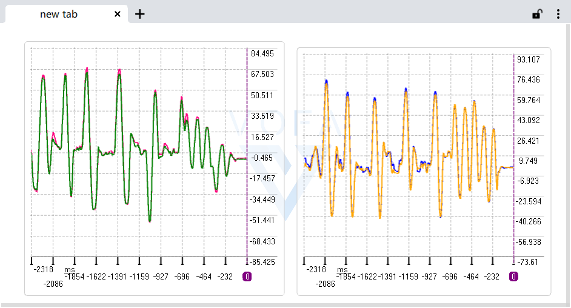

# mpu6050-data-fusion
> get angle by use ComplementaryFilter
## 一、
利用一阶互补滤波对mpu6050陀螺仪和加速度数据融合得到角度信息
## 二、
并让其与mpu6050的dmp解算数据进行对比
图片shot.png展示了pitch与roll角度在自行滤波和移植官方库的区别,
在这副图里面，两个曲线图分别表示pitch与roll的来自两个不同途径的对比

## 三、
本历程的平台未stm32f103rct6，可自行移植到其他的MCU
## 四
### 作者:
阳海峰
### 联系方式：
  #### QQ:
2995339193
  #### mail
mathigeo@tom.com  
  #### [个人网站](mathigeo.github.io)

